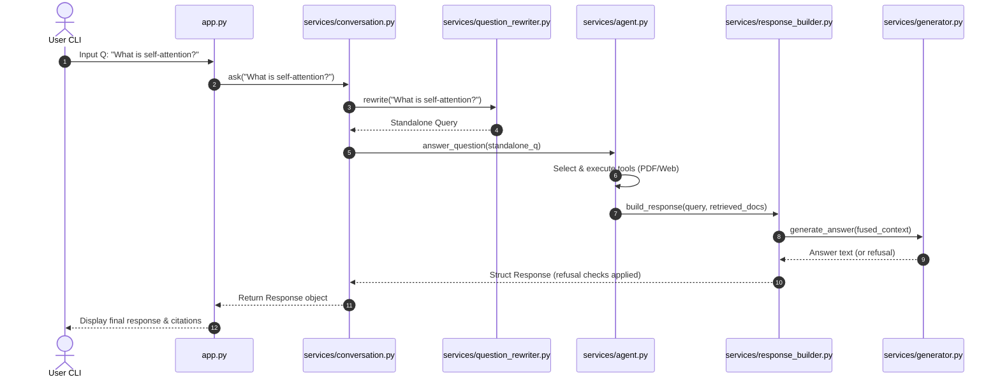
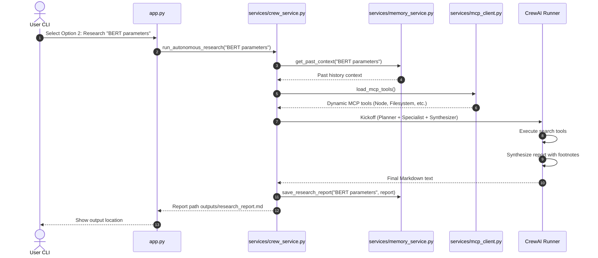

# 🗺️ System Architecture & Data Flows

This document details the sequence lifecycles and execution steps of the application's two operational modes.

---

## 🔄 Flow A: Conversational Interactive RAG (Option 1)

This mode handles natural language multi-turn chat sessions with document grounding.

### Execution Sequence

1.  **CLI Entry (`app.py`):** Accepts user question string, routes it to `ConversationService`.
2.  **Context Resolution (`services/conversation.py`):** Loads the message history window from `ConversationMemory` and hands it to `QuestionRewriter`.
3.  **Standalone Rewriting (`services/question_rewriter.py`):**
    *   If pronouns/references are missing, returns unresolved status and the CLI asks the user for clarification.
    *   If standalone, converts follow-up queries into explicit search queries.
4.  **Agent Action Selection (`services/agent.py`):** Launches ReAct loop. Decides tools using `ToolSelector` and checks execution limits.
5.  **Multi-Source Retrieval:**
    *   `PDFTool` queries Chroma DB vector chunks.
    *   `WebTool` queries Tavily Advanced Search.
6.  **Response Building (`services/response_builder.py`):** Normalizes results to `RetrievalCandidate` structs, reranks them using semantic embeddings cosine distances, groups them by file source to ensure diversity, merges them, and invokes LLM generation.
7.  **Refusal Override Interceptor:** If the LLM generates `NOT_FOUND_MESSAGE` (unknown refusal outcome), clears citations and resets confidence metadata to `NONE`.

### Sequence Diagram

---

## 🤖 Flow B: Autonomous Multi-Agent Research Crew (Option 2)

This mode runs cooperative agents to compile detailed, grounded Markdown research reports.

### Execution Sequence

1.  **CLI Trigger (`app.py`):** Captures the user's research topic and triggers the autonomous kickoff.
2.  **LTM Lookup (`services/memory_service.py`):** Queries `db/memory.db` SQLite table `research_history` for past reports matching topic keywords. Fetches user preferences from `user_preferences`.
3.  **MCP Connection (`services/mcp_client.py`):** Spawns stdio JSON-RPC sub-processes to dynamic server paths defined in `config/mcp_servers.json`. Connects handshakes and registers server tools.
4.  **CrewAI Kickoff (`services/crew_service.py`):** Cooperatively boots:
    *   **Planner:** Drafts structured query list.
    *   **Specialist:** Executes retrieval tools within rate limit caps (max 500 characters per segment).
    *   **Synthesizer:** Merges contexts and generates a comprehensive Markdown report.
5.  **Database & File Sync:** Writes report to `outputs/research_report_<timestamp>.md` and logs context records to the SQLite database.

### Sequence Diagram

